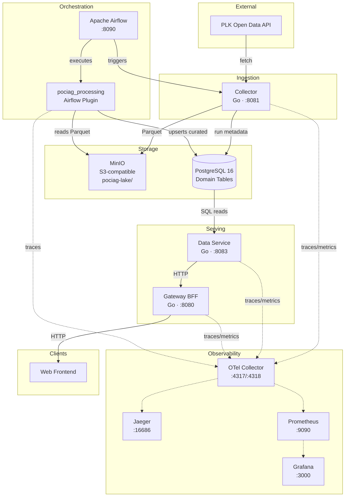
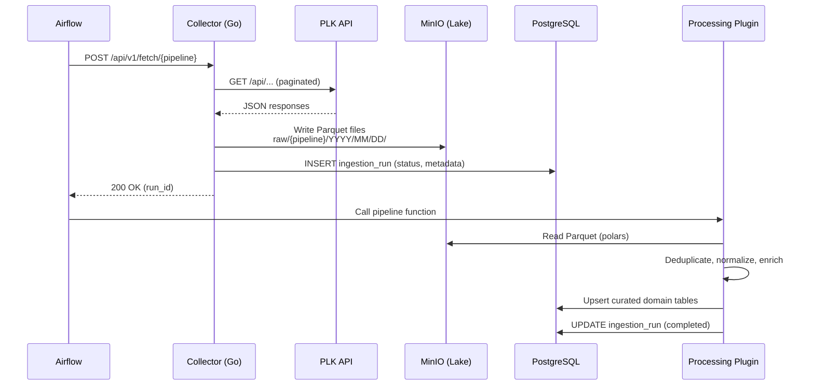
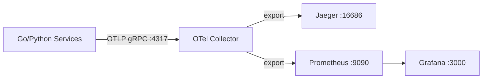

# Architectural Overview

**Pociag do Predykcji** ("Train to Prediction") is a data monitoring and prediction platform
that ingests Polish railway data from the PLK Open Data API, processes it through an ELT
pipeline, and serves curated domain data to a web frontend via a BFF gateway.

## High-Level Architecture



## Data Flow (ELT Pipeline)

The platform implements a two-stage **Extract → Land → Transform** pattern:



### Data Zones

| Zone | Storage | Format | Purpose |
|------|---------|--------|---------|
| **Raw (Bronze)** | MinIO `s3://pociag-lake/raw/` | Parquet | Immutable landing; exact PLK payloads |
| **Curated (Silver)** | PostgreSQL domain tables | Relational | Deduplicated, normalized, query-optimized |

### Lake Layout

```
s3://pociag-lake/
  raw/
    dictionaries/YYYY/MM/DD/run_<id>_<type>.parquet
    schedules/YYYY/MM/DD/run_<id>_page_<N>.parquet
    operations/YYYY/MM/DD/run_<id>_page_<N>.parquet
    disruptions/YYYY/MM/DD/run_<id>.parquet
```

## Service Boundaries

| Service | Language | Responsibility | Port |
|---------|----------|----------------|------|
| **Collector** | Go | Extracts raw data from PLK API → Parquet in MinIO | 8081 |
| **Processing Plugin** | Python | Transforms raw Parquet → curated PostgreSQL tables (runs inside Airflow) | — |
| **Data Service** | Go | Domain read API over curated PostgreSQL tables | 8083 |
| **Gateway (BFF)** | Go | Frontend-facing facade; aggregates Data Service; CORS, caching, rate limiting | 8080 |
| **Airflow** | Python | Orchestrates ingestion + processing DAGs | 8090 |

## Domain Model

Four primary data pipelines, each with its own DAG:

| Pipeline | Schedule | Source | Target Tables |
|----------|----------|--------|---------------|
| **Dictionaries** | Weekly (Mon 03:00) | PLK dictionary endpoints | `stations`, `carriers`, `commercial_categories`, `stop_types` |
| **Schedules** | Weekly (Mon 04:00) | PLK timetable (2-week horizon) | `routes`, `route_stops` |
| **Operations** | Daily (02:00) | PLK train operations (yesterday) | `train_operations` |
| **Disruptions** | Daily (02:30) | PLK disruptions (yesterday) | `disruptions` |

## Technology Stack

| Layer | Technology |
|-------|------------|
| Go services | Go 1.23+, chi router, pgx/v5, net/http |
| Python processing | Python 3.12+, polars, psycopg2 (via Airflow hooks) |
| Orchestration | Apache Airflow 2.9+ (TaskFlow API) |
| Database | PostgreSQL 16 |
| Object Storage | MinIO (S3-compatible) |
| Migrations | golang-migrate (numbered SQL files) |
| Tracing | OpenTelemetry SDK → OTel Collector → Jaeger |
| Metrics | OpenTelemetry SDK → OTel Collector → Prometheus → Grafana |
| Logging | Structured JSON (zap in Go, structlog in Python) |
| Container runtime | Docker Compose (local), Kubernetes (prod) |

## Observability

All services emit traces, metrics, and structured logs via OpenTelemetry:



- **Service naming**: `pociag.<service>` (e.g., `pociag.collector`, `pociag.gateway`)
- **Span naming**: `<noun>.<verb>` (e.g., `record.fetch`, `job.run`)
- **Trace propagation**: W3C TraceContext headers across all inter-service HTTP calls
- **Logging**: JSON with `level`, `ts`, `service`, `trace_id`, `span_id`, `msg`

## Event System

Internal events use PostgreSQL `LISTEN/NOTIFY` (upgradeable to Kafka/NATS):

| Channel | Emitter | Trigger |
|---------|---------|---------|
| `pociag.raw.schedules_fetched` | Collector | After raw Parquet landing |
| `pociag.raw.operations_fetched` | Collector | After raw Parquet landing |
| `pociag.raw.disruptions_fetched` | Collector | After raw Parquet landing |
| `pociag.raw.dictionaries_fetched` | Collector | After raw Parquet landing |
| `pociag.data.schedules_ingested` | Processing Plugin | After curated upsert |
| `pociag.data.operations_ingested` | Processing Plugin | After curated upsert |
| `pociag.data.disruptions_ingested` | Processing Plugin | After curated upsert |

## Key Architectural Decisions

| ADR | Decision | Rationale |
|-----|----------|-----------|
| [ADR-001](decisions/001-base-platform-architecture.md) | Microservice architecture with ELT + CQRS + BFF | Separates ingestion from serving; supports future ML without rewrites |
| [ADR-002](decisions/002-data-lake-raw-landing.md) | Raw landing in MinIO (Parquet) instead of PostgreSQL | 5–10x storage efficiency; native Parquet reads for polars; immutable append-only |
| [ADR-003](decisions/003-processor-to-airflow-plugin.md) | Processing logic as Airflow plugin (not standalone service) | Eliminates extra container; native retry/alerting; single credential store |

## Security Principles

- No hardcoded secrets — all credentials via environment variables or Airflow Connections
- Parameterized SQL queries everywhere (pgx in Go, psycopg2 in Python)
- Input validation at service boundaries
- Dependency scanning: `govulncheck` (Go), `pip audit` (Python) in CI
- Gateway handles CORS, rate limiting; internal services not exposed externally

## Future Extensions

The architecture is designed to accommodate:

- **Predictor Service** (Python/FastAPI) — ML inference for delay prediction
- **Live Tracking** — Real-time train position updates
- **Notification Service** — Alerts on disruptions or delays
- **Frontend** — Web UI for schedule search, maps, dashboards
- **Feature Store** — Materialized features from curated data for ML training
